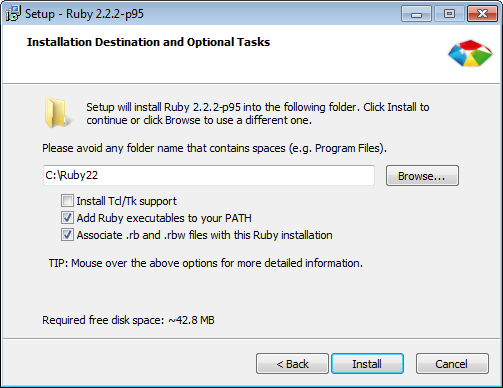

# System Setup
In order to successfully complete this workshop, you will need to prepare your
machine to run Ruby on Rails. See the system-specific instructions below.

## Windows
Install the following tools:

1. [Atom](https://atom.io/) - A text editor. You will be writing all of your
  code in a text editor. Microsoft Word is not acceptable.
2. [Ruby Installer](http://rubyinstaller.org/downloads/) - The Ruby programming
  language interpreter. Download and run the installer for Ruby 2.2.2 (select
  the non-`x64` version).
  * When installing Ruby, select the "Add Ruby executables to your PATH" and
    "Associate .rb and .rbw files with this Ruby installation" options.
    
3. [Ruby DevKit](http://rubyinstaller.org/downloads/) - (Same page as the
  RubyInstaller) Scroll down the page to find the Development Kit and install
  the version for Ruby 2.0 and above (32-bit version).
  * Extract the DevKit to the root directory (e.g. `C:\RubyDevKit`). It is
    important that the location of the DevKit does not include any spaces.
  * Open the command line, `cd` to the install directory and run two commands:
    `ruby dk.rb init` and `ruby dk.rb install`
  * See detailed installation instructions
    [here](https://github.com/oneclick/rubyinstaller/wiki/Development-Kit)
4. [Console](http://sourceforge.net/projects/console/) - A significant
  improvement over Windows' command line (`cmd.exe`).
  * To install, simply unzip the package and place the `Console2` folder in your
    root directory (`C:`). Place a shortcut to `Console.exe` on the Desktop for
    convenience.
5. (BONUS) If you're feeling adventurous, open up Console and install Ruby on
  Rails: run `gem install rails` from the command line.

## Mac OS X
1. Ensure you are running the latest version of OS X
  ([instructions](https://support.apple.com/en-hk/HT201260)). You should be on
  OS X Yosemite (10.10.3).
2. Install the Xcode Command Line Tools. Open the Terminal and run
  `xcode-select --install`
  ([detailed instructions](http://osxdaily.com/2014/02/12/install-command-line-tools-mac-os-x/)).
3. Install [Atom](https://atom.io/), a text editor. You will be writing all of
  your code in a text editor. Microsoft Word is not acceptable.
4. (BONUS) If you're feeling adventurous, open up the Terminal and install Ruby
  on Rails: run `gem install rails` from the command line.

## Troubleshooting
1. Start by reading any error messages from the command line. Do the error
  messages provide any hints on how to resolve the issue?
2. Copy and paste the most relevant parts of the error message into Google.
  Oftentimes, you will find an answer if you search the right keywords. If you
  see results linking to [Stack Overflow](https://stackoverflow.com/), take a
  look there as this site has solutions to many common technical issues.
3. [Contact me](mailto:hubert@scubedsoft.com)! Please specify:
  1. What you were trying to do
  2. What happened
  3. Copy and paste any error messages you saw
